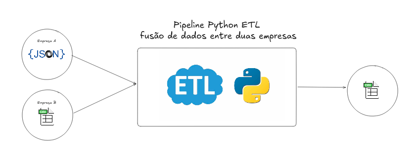

# Pipeline ETL - Fusão de Dados de Mercado

Este projeto implementa uma pipeline ETL (Extract, Transform, Load) em Python para processar e combinar dados de duas fontes: um arquivo JSON (`dados_empresaA.json`) e um arquivo CSV (`dados_empresaB.csv`). Os dados são transformados, unificados e salvos em um arquivo CSV combinado (`dados_combinados.csv`).



## Funcionalidades

- **Extract (Extração)**: Lê dados de arquivos JSON e CSV.
- **Transform (Transformação)**: Renomeia colunas do CSV para padronizar com o JSON.
- **Load (Carregamento)**: Combina os dados e salva em um arquivo CSV.
- **Logging**: Registra o progresso e possíveis erros durante a execução.

## Pré-requisitos

- **Python**: Versão 3.6 ou superior.
- **Bibliotecas**: Nativas do Python (`json`, `csv`, `logging`), sem dependências externas.

## Instalação

1. Clone o repositório ou copie os arquivos para um diretório local:
   ```bash
   git clone https://github.com/esscova/MarketDataFusion.git
   cd MarketDataFusion
   ```

2. Crie os diretórios `data/raw` e `data/processed`:
   ```bash
   mkdir data/raw data/processed
   ```

3. Coloque os arquivos de entrada (`dados_empresaA.json` e `dados_empresaB.csv`) no diretório `data/raw`.

## Uso

### Execução Manual
Para executar a pipeline, navegue até o diretório do projeto e rode o script `main.py`:

```bash
python main.py
```

O script:
- Lê os arquivos de entrada.
- Renomeia as colunas do CSV conforme o mapeamento definido.
- Combina os dados das duas fontes.
- Salva o resultado em `data/processed/dados_combinados.csv`.

Você verá mensagens de log no console indicando o progresso e o status da execução.

### Execução Automática

#### Linux/macOS
Agende a execução com `cron`:
1. Edite o crontab:
   ```bash
   crontab -e
   ```
2. Adicione uma linha para rodar diariamente às 2h:
   ```bash
   0 2 * * * /usr/bin/python3 /caminho/para/main.py
   ```

#### Windows
Use o Agendador de Tarefas:
1. Abra o Agendador de Tarefas.
2. Crie uma nova tarefa com a ação de executar `python main.py` no horário desejado.

## Configuração

### Arquivos de Entrada
- **dados_empresaA.json**: Lista de dicionários no formato JSON.
- **dados_empresaB.csv**: Arquivo CSV com cabeçalho.

Exemplo de estrutura esperada:
- JSON: `[{"Nome do Produto": "Item1", "Preço do Produto (R$)": "10.50", ...}, ...]`
- CSV: `"Nome do Item","Valor em Reais (R$)","Quantidade em Estoque",...`

### Mapeamento de Colunas
O mapeamento de colunas está definido em `main.py` no dicionário `key_mapping`:
```python
key_mapping = {
    'Nome do Item': 'Nome do Produto',
    'Classificação do Produto': 'Categoria do Produto',
    'Valor em Reais (R$)': 'Preço do Produto (R$)',
    'Quantidade em Estoque': 'Quantidade em Estoque',
    'Nome da Loja': 'Filial',
    'Data da Venda': 'Data da Venda'
}
```
Edite este dicionário conforme necessário para alinhar os nomes das colunas do CSV com os do JSON.

### Caminhos dos Arquivos
Os caminhos dos arquivos estão definidos em `main.py`. Ajuste-os se os arquivos estiverem em locais diferentes:
```python
path_json = 'data/raw/dados_empresaA.json'
path_csv = 'data/raw/dados_empresaB.csv'
path_dados_combinados = 'data/processed/dados_combinados.csv'
```

## Detalhes Técnicos

### Classe `Dados` (etl.py)
- **Métodos principais**:
  - `leitura_dados`: Lê arquivos JSON ou CSV e retorna uma instância de `Dados`.
  - `rename_columns`: Renomeia colunas com base em um mapeamento.
  - `join`: Combina duas instâncias de `Dados`.
  - `salvando_dados`: Salva os dados combinados em CSV.
- **Atributos**:
  - `dados`: Lista de dicionários com os registros.
  - `nome_colunas`: Lista de nomes das colunas.
  - `qtd_linhas`: Número total de registros.

### Logging
O logging está configurado para nível `INFO`. Para mais detalhes, altere para `DEBUG` em `main.py`:
```python
logging.basicConfig(level=logging.DEBUG, format='%(asctime)s - %(levelname)s - %(message)s')
```

## Contribuição

Sinta-se à vontade para abrir issues ou enviar pull requests para melhorias, como:
- Suporte a outros formatos de arquivo.
- Validação adicional dos dados de entrada.
- Otimizações de desempenho para grandes volumes de dados.

